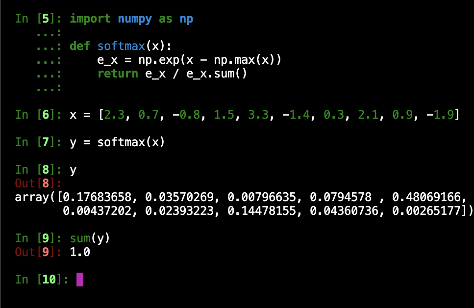

# June 8th, 2023 - MCREU

__What are logits?__

  Logits are 'unnormalized' output values made by the __last output layer before applying an activation function__. Say your running a network for
  the MNIST dataset then your network could produce and output like this __[2.3, 0.7, -0.8, 1.5, 3.3, -1.4, 0.3, 2.1, 0.9, -1.9]__. Each number c-
  orrisponding to one of the 0-9 outputs. After this is done you might add an activation function to these. Which leads to the next question.
  
__What's the softmax function?__ 

  __The Softmax Function:__ 
        
        
  Using the same data from before you can apply the softmax function to a set of numbers and change them into probabilities that sum to 1.
  
  __Also seen here:__
  
   
  
__What does the code do in lines 83-84?__

    83  Reduce('b n c -> b c', 'mean'),
    84  nn.Linear(dim, num_classes)
        
  Lines 83-84 are an application of what was mentioned before, line 83 produces logits and line 84 applies the softmax function and turns the logits
  into probabilites. Together these are called __the classifier head__.
  
__What is LayerNorm?__

   LayerNorm is a type of Normalization, used as a 'technique' to stabalize or speed up the training of a neural network. First, LayerNorm normalizes the        values on all the hidden units in a layer for each feature. Then, computes the mean and standard deviation for normalization on the features and not 
   on an entire batch of data like batch normalization.
  
  
