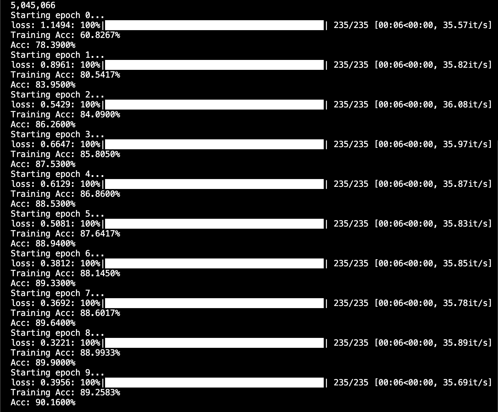
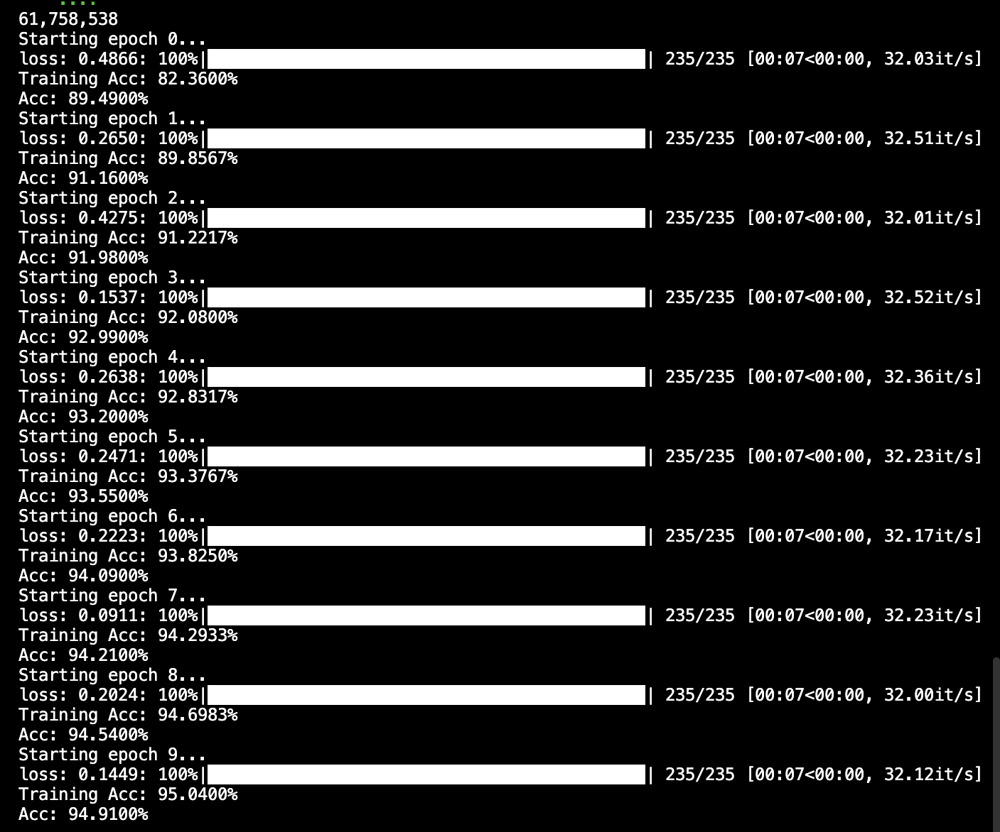
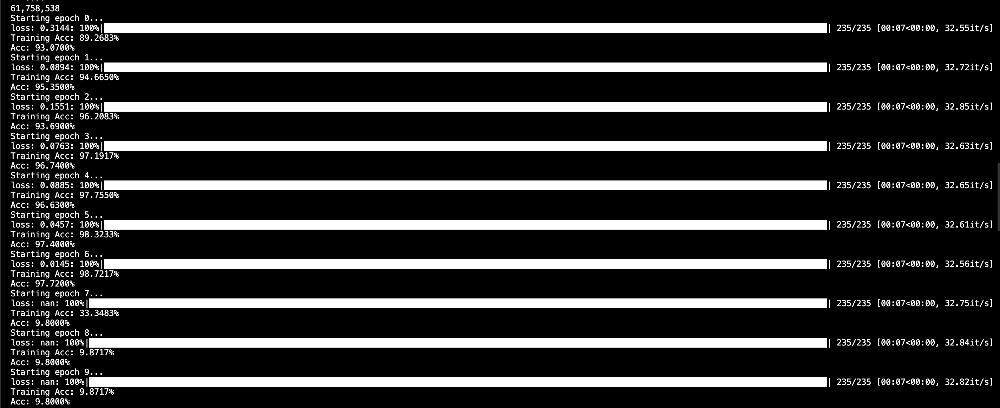

# MNIST Report

__I started this report with a basic Neural Network with a goal to increase the accuracy as much as I could. With that said I will report here any changes that had helped in increasing the overall accuracy.__

__Starting Code:__

        class NNLayer(nn.Module):
            def __init__(self, dim_in, dim_out) -> None:
                super().__init__()
                self.linear = nn.Linear(dim_in, dim_out)
                self.act = nn.GELU()

            def forward(self, x):
                x = self.linear(x)
                x = self.act(x)
                return x

        model = nn.Sequential(
            Rearrange("b c h w -> b (c h w)"),
            NNLayer(1 * 28 * 28, 256),
            NNLayer(256, 256),
            NNLayer(256, 256),
            NNLayer(256, 256),
            nn.Linear(256, 10)
        ).to(device)

After running the code above the starting accuarcy was around 10%, then after another 19 epochs it climbed to 33%. I then used/referenced Jonathan's code which included two linear functions:

        class NNLayer(nn.Module):
            def __init__(self, dim_in, dim_out) -> None:
            super().__init__()
            dim_1 = dim_in * 4
            self.linear = nn.Linear(dim_in, dim_1)
            self.act = nn.GELU()
            self.linear2 = nn.Linear(dim_1, dim_out)
            self.residual = nn.Linear(dim_in, dim_out) if dim_in != dim_out else None

        def forward(self, x):
            org = self.linear(x)
            org = self.act(org)
            org = self.linear2(org)
            if self.residual is None:
                return x + org
            else:
                return self.residual(x) + org

        model = nn.Sequential(
            Rearrange("b c h w -> b (c h w)"),
            NNLayer(1 * 28 * 28, 256),
            NNLayer(256, 256),
            NNLayer(256, 256),
            NNLayer(256, 256),
            nn.Linear(256, 10)
        ).to(device)

Since this code uses a lot better network architecture it was able to get an accuarcy of 90% in just 10 epochs.

After seeing this, I decided to try adding a ReLU function and also lower the learning rate from 1e-3 to 1e-2. By doing this, I was able to get the accuracy to 95% in 10 epochs.

I tested several other changes, most of which either scored lower or roughly equal to the previous score. However in one case I changed the learning rate from a 1e-2 to a 1e-1 which interestingly got a score of 98% on epoch 6 before crashing all the way down to a 10% accuracy on the last epoch. After seeing this I decided to settle for a 95% accuracy.

